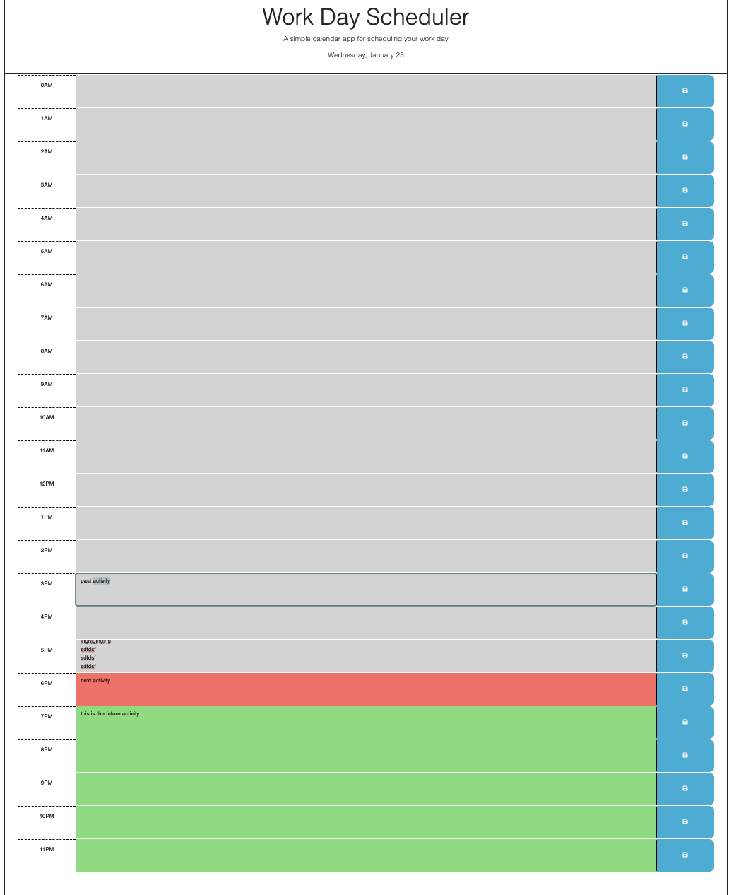

# Work Day Scheduler
Simple calendar application that allows a user to save events for each hour of the day

## Description

This application runs in the browser and features dynamically updated HTML and CSS powered by jQuery.

## Installation

An app is live on Internet and requires to enter and run the following URL from the browser:

https://vasilyl1.github.io/work-day-scheduler

## Usage

When app is launched in the browser, the user is presented with the list of daily events in a view of different colored blocks for every hour of the day.

The blocks differ by the color for the past, present and future hours and there is a timer which updates these colors as the time goes by.

When the events are entered and save buttons are clicked, the information is stored in the local storage of the browser. So when refreshed on that page, the existing information will be loaded from the local storage and updated in the calendar.

Attached screenshot features the screen of the loaded application:

## Credits

N/A

## License

MIT License

Copyright (c) 2022 vasilyl1

Permission is hereby granted, free of charge, to any person obtaining a copy
of this software and associated documentation files (the "Software"), to deal in the Software without restriction, including without limitation the rights to use, copy, modify, merge, publish, distribute, sublicense, and/or sell copies of the Software, and to permit persons to whom the Software is
furnished to do so, subject to the following conditions:

The above copyright notice and this permission notice shall be included in all copies or substantial portions of the Software.

THE SOFTWARE IS PROVIDED "AS IS", WITHOUT WARRANTY OF ANY KIND, EXPRESS OR
IMPLIED, INCLUDING BUT NOT LIMITED TO THE WARRANTIES OF MERCHANTABILITY,
FITNESS FOR A PARTICULAR PURPOSE AND NONINFRINGEMENT. IN NO EVENT SHALL THE
AUTHORS OR COPYRIGHT HOLDERS BE LIABLE FOR ANY CLAIM, DAMAGES OR OTHER
LIABILITY, WHETHER IN AN ACTION OF CONTRACT, TORT OR OTHERWISE, ARISING FROM, OUT OF OR IN CONNECTION WITH THE SOFTWARE OR THE USE OR OTHER DEALINGS IN THE SOFTWARE.